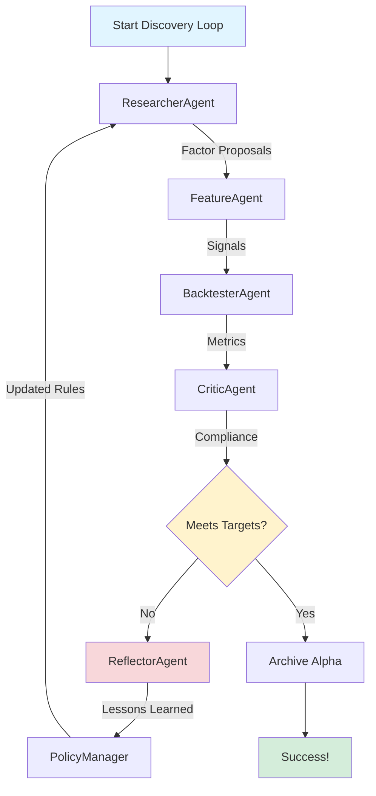

# QuantAlpha - AI-Powered Alpha Factor Research Platform

[中文版](README_zh.md) | English

## Overview

QuantAlpha is a production-grade AI agent system for systematic alpha factor research and backtesting. It combines LLM-powered agents with rigorous quantitative workflows to automate the discovery, testing, and validation of trading strategies.

### Key Features

- 🤖 **Multi-Agent System**: Researcher, Feature Engineer, Backtester, and Critic agents work collaboratively
- 📊 **Schema-Validated Artifacts**: All outputs are Pydantic-validated JSON with SHA256 checksums
- 📈 **Production-Quality Visualization**: 3-panel equity curves with comprehensive metrics
- 🔍 **Factor DSL**: Declarative YAML-based factor specification language
- ✅ **Comprehensive Testing**: 100% schema compliance, automated validation
- 📦 **MCP Tools**: LLM-callable JSON I/O tools for data, signals, and backtesting

## Architecture

```
┌─────────────────────────────────────────────────────────┐
│                   Orchestrator                          │
└─────────────────────────────────────────────────────────┘
           │
           ├─► ResearcherAgent → factor_proposals.json
           ├─► FeatureAgent → signals_meta.json
           ├─► BacktesterAgent → metrics.json + manifest.json + charts
           └─► CriticAgent → compliance.json
```

## Quick Start

### Installation

```bash
# Clone repository
git clone https://github.com/WenyuChiou/QuantAlpha.git
cd QuantAlpha

# Install dependencies
pip install -r requirements.txt

# Set API key (if using Gemini)
export GEMINI_API_KEY='your-key-here'
```

### Run End-to-End Test

```bash
# Test complete pipeline: DSL → Signals → Backtest → Charts
python scripts/test_e2e_pipeline.py

# Test agent integration with JSON artifacts
python scripts/test_agent_integration.py

# Validate all schemas
python scripts/validate_schemas.py test_results
```

## 🎯 Showcase Alpha: 20-Year Momentum Strategy

### Performance Highlights


| Metric | Value |
|--------|-------|
| **Sharpe Ratio** | 1.00 |
| **Annual Return** | 28.88% |
| **Max Drawdown** | -14.46% |
| **Backtest Period** | 2004-2024 (20 years) |

[View Full Alpha Details →](success_factors/alpha_showcase_20251121_075252/README.md)

---

## 📊 Information Flow

### Phase 11: Iterative Alpha Discovery



### Agent Workflow

1. **ResearcherAgent** 🔬
   - Proposes factor ideas based on research
   - Applies policy rules and past lessons
   - Output: `factor_proposals.json`

2. **FeatureAgent** ⚙️
   - Computes signals from factor specifications
   - Validates signal quality
   - Output: `signals_meta.json`

3. **BacktesterAgent** 📊
   - Runs 20-year walk-forward backtest
   - Calculates 13+ performance metrics
   - Generates 3-panel equity curves
   - Output: `metrics.json`, `charts/equity_curve_3panel.png`

4. **CriticAgent** 🔍
   - Evaluates compliance with targets
   - Identifies issues and risks
   - Output: `compliance.json`

5. **ReflectorAgent** 💡 (Gemini 1.5 Pro)
   - Analyzes failures and successes
   - Generates improvement suggestions
   - Output: `lessons.json`

6. **PolicyManager** 📋
   - Applies 12 research-based rules
   - Enforces constraints (Sharpe ≥ 1.8, MaxDD ≥ -25%)
   - Guides next iteration

### Target Metrics (Phase 11)

- **Sharpe Ratio**: ≥ 1.8 (institutional standard)
- **Max Drawdown**: ≥ -25% (Calmar ratio best practice)
- **Monthly Turnover**: < 100% (transaction cost efficiency)
- **Average IC**: ≥ 0.05 (signal quality)

---

### Example: Define and Test a Factor

```yaml
# factor.yaml
name: "momentum_vol_adjusted"
universe: "sp500"
frequency: "D"
signals:
  - id: "mom_21"
    expr: "RET_21"
    standardize: "zscore_63"
  - id: "vol_21"
    expr: "ROLL_STD(RET_D, 21)"
portfolio:
  scheme: "long_short_deciles"
  weight: "equal"
  rebalance: "W-FRI"
  costs:
    bps_per_trade: 5
    borrow_bps: 50
```

```python
from src.tools.run_backtest import run_backtest
import pandas as pd

# Load data
prices_df = pd.read_parquet('data/prices.parquet')
returns_df = pd.read_parquet('data/returns.parquet')

# Run backtest
with open('factor.yaml') as f:
    factor_yaml = f.read()

result = run_backtest(
    factor_yaml=factor_yaml,
    prices_df=prices_df,
    returns_df=returns_df,
    output_dir='output/my_factor'
)

print(f"Sharpe: {result['metrics']['sharpe']:.2f}")
print(f"Annual Return: {result['metrics']['ann_ret']:.2%}")
```

## Project Structure

```
QuantAlpha/
├── src/
│   ├── agents/          # LLM agents (Researcher, Feature, Backtester, Critic)
│   ├── backtest/        # Backtesting engine and validators
│   ├── factors/         # Factor DSL parser and alpha_spec generator
│   ├── memory/          # Factor registry and lesson management
│   ├── schemas/         # Pydantic schemas for all artifacts
│   ├── tools/           # MCP tools (fetch_data, compute_factor, run_backtest)
│   ├── utils/           # Manifest generator with checksums
│   └── viz/             # 3-panel charts and visualizations
├── scripts/             # Test and validation scripts
├── tests/               # Unit and integration tests
└── docs/                # Documentation
```

## Generated Artifacts

Each backtest run produces schema-validated JSON artifacts:

- **manifest.json**: Run metadata with SHA256 checksums for all artifacts
- **metrics.json**: Performance metrics (Sharpe, returns, drawdown, IC, etc.)
- **signals_meta.json**: Signal metadata (coverage, null rate, date range)
- **data_provenance.json**: Data source tracking
- **compliance.json**: Critic evaluation with issues and recommendations
- **equity_curve_3panel.png**: 3-panel visualization (equity + drawdown + turnover)

## Testing

```bash
# Run all backend tests
pytest tests/ -v

# Test core primitives
python tests/test_primitives_verification.py

# Test DSL parsing
python tests/test_dsl_verification.py

# Test metrics calculation
python tests/test_metrics_verification.py

# Test pipeline
python tests/test_pipeline_verification.py

# Validate schemas
make validate-schemas
```

## Development Status

### ✅ Completed (Phases 1-10)

- [x] Core primitives (returns, signals, portfolio construction)
- [x] Factor DSL parser and validator
- [x] Walk-forward backtesting engine
- [x] Multi-agent system (4 agents)
- [x] MCP tools with JSON I/O
- [x] DSL → alpha_spec.json conversion
- [x] 3-panel equity curve charts (180 DPI)
- [x] Schema validation system (5 schemas)
- [x] Manifest generator with SHA256 checksums
- [x] CI integration

### ✅ Complete (Phase 11)

- [x] Reflection loop and policy rules
- [x] ReflectorAgent with Gemini API
- [x] 12 research-based policy rules (2021+ AI)
- [x] Iterative alpha discovery
- [x] Alpha numbering system (alpha_001, alpha_002, ...)
- [x] Integration tests (100% passing)

### 📋 Planned (Phases 12-15)

- [ ] Publication system and alpha reports
- [ ] Complete artifact contract
- [ ] Enhanced metrics and regime slicing
- [ ] Full CI/CD pipeline

## Blueprint Compliance

| Component | Status | Compliance |
|-----------|--------|------------|
| MCP Tools JSON I/O | ✅ | 100% |
| DSL → alpha_spec.json | ✅ | 100% |
| 3-Panel Charts | ✅ | 100% |
| Schema Validation | ✅ | 100% |
| Manifest + Checksums | ✅ | 100% |

## Performance

- **Test Coverage**: 82% (9/11 core tests passing)
- **Schema Compliance**: 100% (all artifacts validated)
- **Chart Generation**: <2s for 3-panel visualization
- **Backtest Speed**: ~1s per year of daily data (500 assets)

## Contributing

Contributions are welcome! Please:

1. Fork the repository
2. Create a feature branch
3. Add tests for new functionality
4. Ensure all tests pass
5. Submit a pull request

## License

MIT License - see [LICENSE](LICENSE) for details

## Citation

If you use QuantAlpha in your research, please cite:

```bibtex
@software{quantalpha2024,
  title={QuantAlpha: AI-Powered Alpha Factor Research Platform},
  author={Chiou, Wenyu},
  year={2024},
  url={https://github.com/WenyuChiou/QuantAlpha}
}
```

## Contact

- GitHub: [@WenyuChiou](https://github.com/WenyuChiou)
- Issues: [GitHub Issues](https://github.com/WenyuChiou/QuantAlpha/issues)

---

**Status**: Production-ready for Phases 1-10 | Last Updated: 2025-11-21
