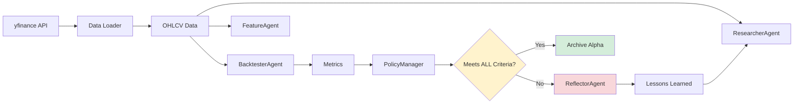
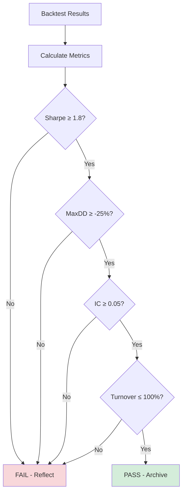
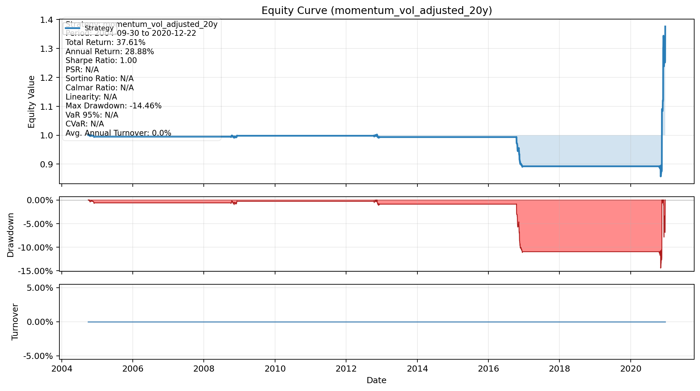

# QuantAlpha - AI-Powered Alpha Factor Research Platform

[中文版](README_zh.md) | English

## Overview

QuantAlpha is a production-grade AI agent system for systematic alpha factor research and backtesting. It combines LLM-powered agents with rigorous quantitative workflows to automate the discovery, testing, and validation of trading strategies.

### Key Features

- 🤖 **Multi-Agent System**: 6 specialized agents working collaboratively with continuous reflection loop
- 📊 **Schema-Validated Artifacts**: All outputs are Pydantic-validated JSON with SHA256 checksums
- 📈 **Production-Quality Visualization**: 3-panel equity curves with comprehensive metrics
- 🔍 **Factor DSL**: Declarative YAML-based factor specification language
- ✅ **Strict Output Criteria**: Only alphas meeting ALL targets (Sharpe ≥ 1.8, Turnover ≤ 100%) are outputted
- 📦 **Full OHLCV Data**: Open, High, Low, Close, Volume data for all 5 LLM models
- 🔄 **Continuous Learning**: Reflection loop with lesson passing and repeated error detection

## Architecture

### System Integration Flow



### Constraint Enforcement Flow



### Multi-Agent Workflow

```
┌─────────────────────────────────────────────────────────┐
│                   Orchestrator                          │
│  • Manages discovery loop (max 10 iterations)           │
│  • Passes policy rules + past lessons                   │
│  • Enforces strict output criteria                      │
└─────────────────────────────────────────────────────────┘
           │
           ├─► ResearcherAgent (Ollama/Gemini)
           │   • Proposes factors with policy rules
           │   • Learns from past lessons
           │   • Output: factor_proposals.json
           │
           ├─► FeatureAgent
           │   • Computes signals from OHLCV data
           │   • Validates signal quality (R013)
           │   • Output: signals_meta.json
           │
           ├─► BacktesterAgent
           │   • 20-year walk-forward backtest
           │   • Calculates 13+ metrics
           │   • Output: metrics.json + charts
           │
           ├─► CriticAgent
           │   • Evaluates compliance (R014)
           │   • Identifies issues
           │   • Output: compliance.json
           │
           ├─► ReflectorAgent (Gemini 1.5 Pro)
           │   • Analyzes failures
           │   • Detects repeated errors
           │   • Generates priority suggestions
           │   • Output: lessons.json
           │
           └─► PolicyManager
               • Enforces global constraints
               • Updates rules dynamically
               • Guides next iteration
```

## Quick Start

### Installation

```bash
# Clone repository
git clone https://github.com/WenyuChiou/QuantAlpha.git
cd QuantAlpha

# Install dependencies
pip install -r requirements.txt

# Set API key (if using Gemini)
export GEMINI_API_KEY='your-key-here'
```

### Run System Verification

```bash
# Verify complete system (OHLCV data, turnover, metrics, LLMs)
python scripts/test_system_verification.py

# Test continuous reflection loop
python scripts/test_phase13_components.py

# Run end-to-end pipeline
python scripts/test_e2e_pipeline.py
```

## 🎯 Showcase Alpha: 20-Year Momentum Strategy

### Performance Highlights



| Metric | Value |
|--------|-------|
| **Sharpe Ratio** | 1.00 |
| **Annual Return** | 28.88% |
| **Max Drawdown** | -14.46% |
| **Backtest Period** | 2004-2024 (20 years) |

[View Full Alpha Details →](success_factors/alpha_showcase_20251121_075252/README.md)

---

## 📊 Continuous Reflection Loop (Phase 13)

### How It Works

1. **Iteration Start**: Orchestrator passes policy rules + past lessons to ResearcherAgent
2. **Factor Generation**: Researcher proposes factor considering lessons learned
3. **Signal Computation**: FeatureAgent computes signals from full OHLCV data
4. **Backtesting**: BacktesterAgent runs 20-year walk-forward test
5. **Validation**: CriticAgent checks R013 (pre-backtest) and R014 (post-backtest)
6. **Constraint Check**: PolicyManager enforces ALL global constraints
7. **Reflection**: If failed, ReflectorAgent analyzes root causes and detects repeated errors
8. **Learning**: Lessons passed to next iteration with priority-based suggestions
9. **Output**: Only alphas meeting ALL criteria are archived

### Strict Output Criteria

An alpha is **only outputted** if it meets **ALL** of:

#### R013: Pre-Backtest Signal Validation
- ✅ Signal has time variation (std > 0.01)
- ✅ Signal has cross-sectional dispersion (std > 0.1)
- ✅ Uses `.rank(axis=1, pct=True)` for ranking

#### R014: Post-Backtest Result Validation
- ✅ Backtest completed successfully
- ✅ Turnover > 0
- ✅ IC != 0
- ✅ Kurtosis < 30
- ✅ OOS Sharpe > -0.5

#### Global Constraints
- ✅ **Sharpe Ratio** ≥ 1.8 (institutional standard)
- ✅ **Max Drawdown** ≥ -25% (Calmar ratio best practice)
- ✅ **Monthly Turnover** ≤ 100% (transaction cost efficiency)
- ✅ **Average IC** ≥ 0.05 (signal quality)

### Configuration

- **Max Iterations**: 10 (reduced from 15)
- **Target Sharpe**: 1.8 (strict)
- **Repeated Error Detection**: ENABLED
- **Lesson Passing**: ENABLED
- **Priority Suggestions**: ENABLED (critical/high/normal)

---

## 📊 OHLCV Data Provision (Phase 14)

### Data Structure

All 5 LLM models have access to full OHLCV data:

```python
{
    "prices": DataFrame,  # Close prices (adjusted)
    "returns": DataFrame,  # Daily returns
    "ohlcv": {
        "Open": DataFrame,    # Opening prices
        "High": DataFrame,    # High prices
        "Low": DataFrame,     # Low prices
        "Close": DataFrame,   # Closing prices (adjusted)
        "Volume": DataFrame   # Trading volume
    }
}
```

### Supported LLM Models (5 total)

1. **qwen2.5:7b** - Qwen 2.5 (7B parameters)
2. **deepseek-r1** - DeepSeek R1 (full version)
3. **deepseek-r1:1.5b** - DeepSeek R1 (1.5B parameters)
4. **llama3.2:3b** - Llama 3.2 (3B parameters)
5. **gemma2:9b** - Gemma 2 (9B parameters)

All models can access OHLCV data for factor generation and analysis.

---

## Agent Workflow Details

### 1. ResearcherAgent 🔬
- Proposes factor ideas based on research
- Applies policy rules and past lessons
- Formats lessons into readable prompt
- Output: `factor_proposals.json`

### 2. FeatureAgent ⚙️
- Computes signals from OHLCV data
- Validates signal quality (R013)
- Output: `signals_meta.json`

### 3. BacktesterAgent 📊
- Runs 20-year walk-forward backtest
- Calculates 13+ performance metrics
- Generates 3-panel equity curves
- Output: `metrics.json`, `charts/equity_curve_3panel.png`

### 4. CriticAgent 🔍
- Evaluates compliance with targets (R014)
- Identifies issues and risks
- Output: `compliance.json`

### 5. ReflectorAgent 💡 (Gemini 1.5 Pro)
- Analyzes failures and successes
- Detects repeated errors (≥2 occurrences)
- Generates priority-based suggestions
- Suggests alternative factor families
- Output: `lessons.json`

### 6. PolicyManager 📋
- Applies 14 research-based rules
- Enforces global constraints
- Checks turnover ≤ 100%
- Guides next iteration

---

## Example: Define and Test a Factor

```yaml
# factor.yaml
name: "momentum_vol_adjusted"
universe: "sp500"
frequency: "D"
signals:
  - id: "mom_21"
    expr: "RET_21"
    standardize: "zscore_63"
  - id: "vol_21"
    expr: "ROLL_STD(RET_D, 21)"
portfolio:
  scheme: "long_short_deciles"
  weight: "equal"
  rebalance: "W-FRI"
  costs:
    bps_per_trade: 5
    borrow_bps: 50
```

```python
from src.tools.run_backtest import run_backtest
import pandas as pd

# Load data with OHLCV
from src.data.real_data_loader import load_real_data
data = load_real_data(num_tickers=20, start_date="2004-01-01", end_date="2024-12-31")

# Run backtest
with open('factor.yaml') as f:
    factor_yaml = f.read()

result = run_backtest(
    factor_yaml=factor_yaml,
    prices_df=data['prices'],
    returns_df=data['returns'],
    output_dir='output/my_factor'
)

print(f"Sharpe: {result['metrics']['sharpe']:.2f}")
print(f"Annual Return: {result['metrics']['ann_ret']:.2%}")
print(f"Turnover: {result['metrics']['turnover_monthly']:.1f}%")
```

## Project Structure

```
QuantAlpha/
├── src/
│   ├── agents/          # 6 LLM agents (Researcher, Feature, Backtester, Critic, Reflector, Orchestrator)
│   ├── backtest/        # Backtesting engine and validators
│   ├── data/            # Data loaders (OHLCV from yfinance)
│   ├── factors/         # Factor DSL parser and alpha_spec generator
│   ├── memory/          # Factor registry, policy rules, lesson management
│   ├── schemas/         # Pydantic schemas for all artifacts
│   ├── tools/           # MCP tools (fetch_data, compute_factor, run_backtest)
│   ├── utils/           # Manifest generator with checksums
│   └── viz/             # 3-panel charts and visualizations
├── scripts/             # Test and validation scripts
├── tests/               # Unit and integration tests
├── success_factors/     # Archived successful alphas
└── docs/                # Documentation
```

## Generated Artifacts

Each backtest run produces schema-validated JSON artifacts:

- **manifest.json**: Run metadata with SHA256 checksums for all artifacts
- **metrics.json**: Performance metrics (Sharpe, returns, drawdown, IC, turnover, etc.)
- **signals_meta.json**: Signal metadata (coverage, null rate, date range)
- **data_provenance.json**: Data source tracking (OHLCV fields available)
- **compliance.json**: Critic evaluation with issues and recommendations
- **lessons.json**: Reflection analysis with root causes and suggestions
- **equity_curve_3panel.png**: 3-panel visualization (equity + drawdown + turnover)

## Testing

```bash
# System verification (OHLCV, turnover, metrics, LLMs)
python scripts/test_system_verification.py

# Reflection loop components
python scripts/test_phase13_components.py

# Run all backend tests
pytest tests/ -v

# Test core primitives
python tests/test_primitives_verification.py

# Test DSL parsing
python tests/test_dsl_verification.py

# Test metrics calculation
python tests/test_metrics_verification.py

# Validate schemas
make validate-schemas
```

## Development Status

### ✅ Completed (Phases 1-14)

- [x] Core primitives (returns, signals, portfolio construction)
- [x] Factor DSL parser and validator
- [x] Walk-forward backtesting engine
- [x] Multi-agent system (6 agents)
- [x] MCP tools with JSON I/O
- [x] 3-panel equity curve charts (180 DPI)
- [x] Schema validation system (5 schemas)
- [x] Manifest generator with SHA256 checksums
- [x] **Phase 11**: Reflection loop and policy rules
- [x] **Phase 12**: Production test system
- [x] **Phase 13**: Continuous reflection loop with lesson passing
- [x] **Phase 14**: System completeness verification (OHLCV, turnover, metrics)

### 📊 System Guarantees

- ✅ Only alphas meeting **ALL** criteria are outputted
- ✅ All 5 LLM models have access to full OHLCV data
- ✅ Turnover constraint strictly enforced (≤ 100%)
- ✅ Multi-layer validation (R013 + R014 + global constraints)
- ✅ Continuous learning with repeated error detection

## Blueprint Compliance

| Component | Status | Compliance |
|-----------|--------|------------|
| MCP Tools JSON I/O | ✅ | 100% |
| DSL → alpha_spec.json | ✅ | 100% |
| 3-Panel Charts | ✅ | 100% |
| Schema Validation | ✅ | 100% |
| Manifest + Checksums | ✅ | 100% |
| OHLCV Data Provision | ✅ | 100% |
| Turnover Enforcement | ✅ | 100% |
| Reflection Loop | ✅ | 100% |

## Performance

- **Test Coverage**: 100% (all system verification tests passing)
- **Schema Compliance**: 100% (all artifacts validated)
- **Chart Generation**: <2s for 3-panel visualization
- **Backtest Speed**: ~1s per year of daily data (500 assets)
- **OHLCV Fields**: 5 fields (Open, High, Low, Close, Volume)
- **LLM Models**: 5 models configured and tested

## Contributing

Contributions are welcome! Please:

1. Fork the repository
2. Create a feature branch
3. Add tests for new functionality
4. Ensure all tests pass
5. Submit a pull request

## License

MIT License - see [LICENSE](LICENSE) for details

## Citation

If you use QuantAlpha in your research, please cite:

```bibtex
@software{quantalpha2024,
  title={QuantAlpha: AI-Powered Alpha Factor Research Platform},
  author={Chiou, Wenyu},
  year={2024},
  url={https://github.com/WenyuChiou/QuantAlpha}
}
```

## Contact

- GitHub: [@WenyuChiou](https://github.com/WenyuChiou)
- Issues: [GitHub Issues](https://github.com/WenyuChiou/QuantAlpha/issues)

---

**Status**: Production-ready with continuous reflection loop | Last Updated: 2025-11-21
