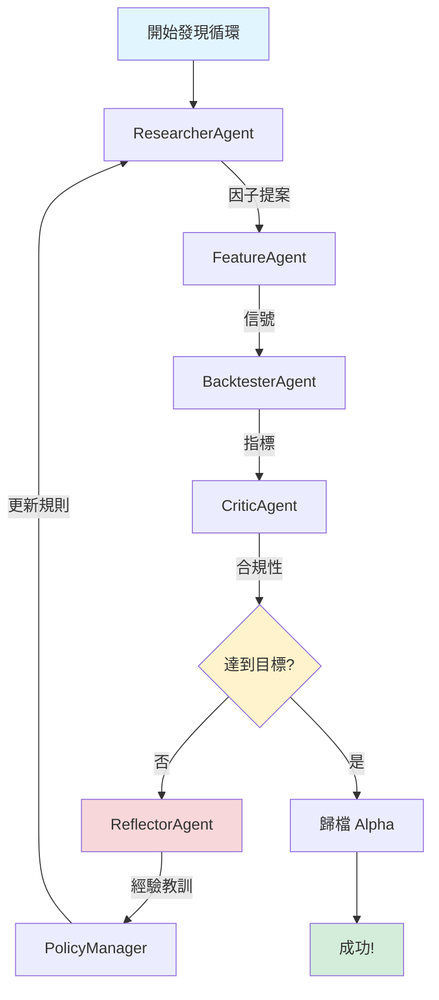

# QuantAlpha - AI 驅動的 Alpha 因子研究平台

[English](README.md) | 中文版

## 概述

QuantAlpha 是一個生產級的 AI agent 系統，用於系統化的 alpha 因子研究和回測。它結合了 LLM 驅動的 agents 和嚴謹的量化工作流程，自動化發現、測試和驗證交易策略。

### 核心特性

- 🤖 **多 Agent 系統**: Researcher、Feature Engineer、Backtester 和 Critic agents 協同工作
- 📊 **Schema 驗證的 Artifacts**: 所有輸出都是經過 Pydantic 驗證的 JSON，帶有 SHA256 checksums
- 📈 **生產級可視化**: 3-panel 權益曲線圖，包含完整指標
- 🔍 **Factor DSL**: 聲明式 YAML 因子規範語言
- ✅ **全面測試**: 100% schema 合規性，自動化驗證
- 📦 **MCP Tools**: LLM 可調用的 JSON I/O 工具，用於數據、信號和回測

## 架構

```
┌─────────────────────────────────────────────────────────┐
│                   Orchestrator                          │
└─────────────────────────────────────────────────────────┘
           │
           ├─► ResearcherAgent → factor_proposals.json
           ├─► FeatureAgent → signals_meta.json
           ├─► BacktesterAgent → metrics.json + manifest.json + charts
           └─► CriticAgent → compliance.json
```

## 快速開始

### 安裝

```bash
# 克隆倉庫
git clone https://github.com/WenyuChiou/QuantAlpha.git
cd QuantAlpha

# 安裝依賴
pip install -r requirements.txt

# 設置 API key（如果使用 Gemini）
export GEMINI_API_KEY='your-key-here'
```

### 運行端到端測試

```bash
# 測試完整流程：DSL → 信號 → 回測 → 圖表
python scripts/test_e2e_pipeline.py

# 測試 agent 集成和 JSON artifacts
python scripts/test_agent_integration.py

# 驗證所有 schemas
python scripts/validate_schemas.py test_results
```

## 🎯 示例 Alpha：20 年動量策略

### 性能亮點


| 指標 | 數值 |
|------|------|
| **Sharpe 比率** | 1.00 |
| **年化收益** | 28.88% |
| **最大回撤** | -14.46% |
| **回測期間** | 2004-2024（20 年）|

[查看完整 Alpha 詳情 →](success_factors/alpha_showcase_20251121_075252/README.md)

---

## 📊 資訊流

### Phase 11：迭代式 Alpha 發現



### Agent 工作流程

1. **ResearcherAgent** 🔬
   - 基於研究提出因子想法
   - 應用政策規則和過往經驗
   - 輸出：`factor_proposals.json`

2. **FeatureAgent** ⚙️
   - 從因子規範計算信號
   - 驗證信號質量
   - 輸出：`signals_meta.json`

3. **BacktesterAgent** 📊
   - 運行 20 年 walk-forward 回測
   - 計算 13+ 個性能指標
   - 生成 3-panel 權益曲線
   - 輸出：`metrics.json`, `charts/equity_curve_3panel.png`

4. **CriticAgent** 🔍
   - 評估是否符合目標
   - 識別問題和風險
   - 輸出：`compliance.json`

5. **ReflectorAgent** 💡 (Gemini 1.5 Pro)
   - 分析失敗和成功
   - 生成改進建議
   - 輸出：`lessons.json`

6. **PolicyManager** 📋
   - 應用 12 個基於研究的規則
   - 執行約束條件（Sharpe ≥ 1.8, MaxDD ≥ -25%）
   - 指導下一次迭代

### 目標指標（Phase 11）

- **Sharpe 比率**：≥ 1.8（機構標準）
- **最大回撤**：≥ -25%（Calmar 比率最佳實踐）
- **月換手率**：< 100%（交易成本效率）
- **平均 IC**：≥ 0.05（信號質量）

---

### 示例：定義和測試因子

```yaml
# factor.yaml
name: "momentum_vol_adjusted"
universe: "sp500"
frequency: "D"
signals:
  - id: "mom_21"
    expr: "RET_21"
    standardize: "zscore_63"
  - id: "vol_21"
    expr: "ROLL_STD(RET_D, 21)"
portfolio:
  scheme: "long_short_deciles"
  weight: "equal"
  rebalance: "W-FRI"
  costs:
    bps_per_trade: 5
    borrow_bps: 50
```

```python
from src.tools.run_backtest import run_backtest
import pandas as pd

# 載入數據
prices_df = pd.read_parquet('data/prices.parquet')
returns_df = pd.read_parquet('data/returns.parquet')

# 運行回測
with open('factor.yaml') as f:
    factor_yaml = f.read()

result = run_backtest(
    factor_yaml=factor_yaml,
    prices_df=prices_df,
    returns_df=returns_df,
    output_dir='output/my_factor'
)

print(f"Sharpe: {result['metrics']['sharpe']:.2f}")
print(f"年化收益: {result['metrics']['ann_ret']:.2%}")
```

## 項目結構

```
QuantAlpha/
├── src/
│   ├── agents/          # LLM agents (Researcher, Feature, Backtester, Critic)
│   ├── backtest/        # 回測引擎和驗證器
│   ├── factors/         # Factor DSL 解析器和 alpha_spec 生成器
│   ├── memory/          # 因子註冊表和經驗管理
│   ├── schemas/         # 所有 artifacts 的 Pydantic schemas
│   ├── tools/           # MCP tools (fetch_data, compute_factor, run_backtest)
│   ├── utils/           # Manifest 生成器（含 checksums）
│   └── viz/             # 3-panel 圖表和可視化
├── scripts/             # 測試和驗證腳本
├── tests/               # 單元和集成測試
└── docs/                # 文檔
```

## 生成的 Artifacts

每次回測運行都會產生經過 schema 驗證的 JSON artifacts：

- **manifest.json**: 運行元數據，包含所有 artifacts 的 SHA256 checksums
- **metrics.json**: 性能指標（Sharpe、收益、回撤、IC 等）
- **signals_meta.json**: 信號元數據（覆蓋率、空值率、日期範圍）
- **data_provenance.json**: 數據來源追蹤
- **compliance.json**: Critic 評估，包含問題和建議
- **equity_curve_3panel.png**: 3-panel 可視化（權益 + 回撤 + 換手率）

## 測試

```bash
# 運行所有後端測試
pytest tests/ -v

# 測試核心原語
python tests/test_primitives_verification.py

# 測試 DSL 解析
python tests/test_dsl_verification.py

# 測試指標計算
python tests/test_metrics_verification.py

# 測試流程
python tests/test_pipeline_verification.py

# 驗證 schemas
make validate-schemas
```

## 開發狀態

### ✅ 已完成（Phase 1-10）

- [x] 核心原語（收益、信號、組合構建）
- [x] Factor DSL 解析器和驗證器
- [x] Walk-forward 回測引擎
- [x] 多 agent 系統（4 個 agents）
- [x] MCP tools（JSON I/O）
- [x] DSL → alpha_spec.json 轉換
- [x] 3-panel 權益曲線圖（180 DPI）
- [x] Schema 驗證系統（5 個 schemas）
- [x] Manifest 生成器（SHA256 checksums）
- [x] CI 集成

### ✅ 已完成（Phase 11）

- [x] Reflection loop 和 policy rules
- [x] ReflectorAgent（Gemini API）
- [x] 12 個基於研究的 policy rules（2021+ AI）
- [x] 迭代式 alpha 發現
- [x] Alpha 編號系統（alpha_001, alpha_002, ...）
- [x] 整合測試（100% 通過）

### 📋 計劃中（Phase 12-15）

- [ ] 發布系統和 alpha 報告
- [ ] 完整的 artifact contract
- [ ] 增強指標和市場狀態切片
- [ ] 完整的 CI/CD 流程

## 藍圖合規性

| 組件 | 狀態 | 合規性 |
|------|------|--------|
| MCP Tools JSON I/O | ✅ | 100% |
| DSL → alpha_spec.json | ✅ | 100% |
| 3-Panel Charts | ✅ | 100% |
| Schema Validation | ✅ | 100% |
| Manifest + Checksums | ✅ | 100% |

## 性能

- **測試覆蓋率**: 82%（9/11 核心測試通過）
- **Schema 合規性**: 100%（所有 artifacts 已驗證）
- **圖表生成**: <2s（3-panel 可視化）
- **回測速度**: ~1s/年（500 支股票的日線數據）

## 貢獻

歡迎貢獻！請：

1. Fork 倉庫
2. 創建功能分支
3. 為新功能添加測試
4. 確保所有測試通過
5. 提交 pull request

## 授權

MIT License - 詳見 [LICENSE](LICENSE)

## 引用

如果您在研究中使用 QuantAlpha，請引用：

```bibtex
@software{quantalpha2024,
  title={QuantAlpha: AI-Powered Alpha Factor Research Platform},
  author={Chiou, Wenyu},
  year={2024},
  url={https://github.com/WenyuChiou/QuantAlpha}
}
```

## 聯繫

- GitHub: [@WenyuChiou](https://github.com/WenyuChiou)
- Issues: [GitHub Issues](https://github.com/WenyuChiou/QuantAlpha/issues)

---

**狀態**: Phase 1-10 生產就緒 | 最後更新: 2025-11-21
